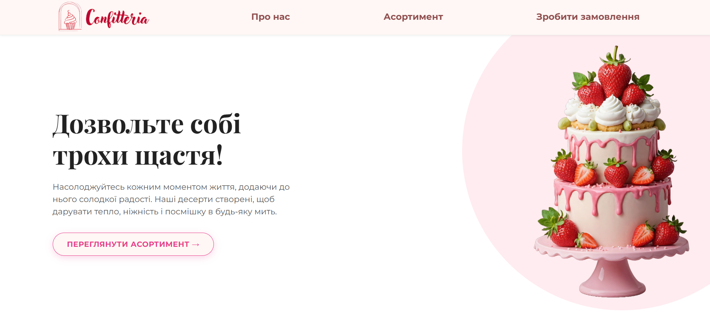
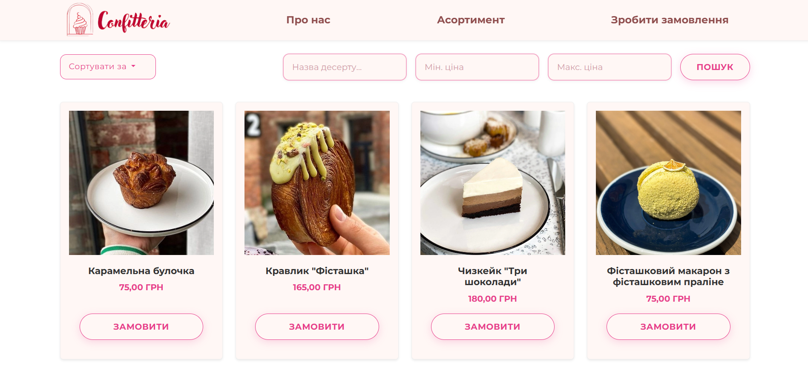
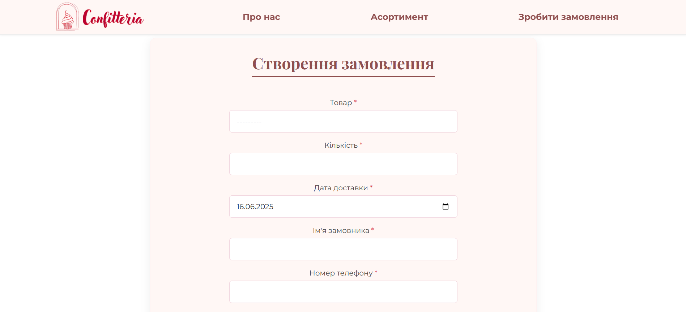

# 🎂 Кондитерська "Confitteria" 🍰

Веб-сайт для уявної кондитерської "Confitteria", розроблений на Django. Дозволяє користувачам переглядати асортимент, робити замовлення, а адміністраторам — керувати продукцією та замовленнями.

Цей проєкт був створений з метою вивчення та демонстрації можливостей Django, а також для практики у веб-розробці.

---

## 🚀 Жива Версія (Live Demo)
Ви можете переглянути розгорнутий проект тут: http://okilkamarta.pythonanywhere.com/

## 📸 Скріншоти Проєкту

### Головна сторінка:


### Сторінка Про нас:


### Сторінка Асортименту:


### Форма Замовлення:


---

## ✨ Основні Функції

### Для Користувачів:
- Перегляд головної сторінки з обраними товарами та інформацією про кондитерську.
- Детальний перегляд асортименту з можливістю пошуку за назвою та фільтрації за ціною.
- Оформлення замовлення через зручну форму.
- Отримання інформації про компанію на сторінці "Про нас".

### Для Адміністраторів (через Django Admin):
- Керування товарами: додавання, редагування, видалення позицій асортименту, завантаження зображень.
- Керування замовленнями: перегляд деталей замовлень, зміна статусів.

---

## 🛠️ Використані Технології

**Backend:**
- Python 3.8+
- Django 5.1+
- SQLite

**Frontend:**
- HTML5
- CSS3 (Flexbox, Grid, змінні)
- Bootstrap 5
- JavaScript

**Інструменти:**
- `python-dotenv`
- `Pillow`
- `django-cleanup`
- Git

---

## ⚙️ Встановлення та Запуск Проєкту

### 1. Попередні Вимоги

- Python 3.8+ — [Завантажити](https://www.python.org/downloads/)
- Git — [Завантажити](https://git-scm.com/downloads)
- Windows (або адаптація для Linux/macOS)

### 2. Клонування Репозиторію

```bash
git clone https://github.com/OkayMarta/pastry-shop.git
cd pastry-shop
```

### 3. Налаштування Віртуального Середовища
Windows (через скрипт):
**Windows (через скрипт):**
Запустіть:
```bash
setup_env.bat
```
**Linux/macOS або вручну:**
```bash
# Створення віртуального середовища
python -m venv venv

# Активація
# Linux/macOS:
source venv/bin/activate
# Windows (cmd.exe):
venv\Scripts\activate.bat
# Windows (PowerShell):
# .\venv\Scripts\Activate.ps1

# Встановлення залежностей
pip install -r requirements.txt
```

### 4. Створіть .env файл та додайте змінні:
```env
DJANGO_SECRET_KEY='your_very_secret_django_key_here_for_production_or_a_random_one_for_dev'
DJANGO_DEBUG=True
DJANGO_ALLOWED_HOSTS=127.0.0.1,localhost

EMAIL_HOST_USER='your-email@gmail.com'
EMAIL_HOST_PASSWORD='your-gmail-app-password' # Для Gmail потрібен "Пароль додатка"
ADMIN_EMAIL='your-admin-email@example.com'
```

### 5. Налаштування Бази Даних
Windows:
```bash
reset_db.bat
```
Linux/macOS або вручну:
```bash
python manage.py makemigrations shop
python manage.py migrate
python manage.py createsuperuser
```

### 6. Додайте Товари через Адмін панель
Адреса: http://127.0.0.1:8000/admin/

### 7. Запуск Сервера
Windows:
```bash
run_server.bat
```
Інші ОС або вручну:
```bash
python manage.py runserver
```

### 8. Зупинка Сервера
Натисніть Ctrl+C в терміналі.

---

## 📁 Структура Проєкту
```plaintext
pastry-shop/
├── my_bakery/
│   ├── settings.py
│   ├── urls.py
│   └── ...
├── shop/
│   ├── models.py
│   ├── views.py
│   ├── forms.py
│   ├── admin.py
│   ├── urls.py
│   └── templates/shop/
├── static/
├── media/
├── venv/
├── manage.py
├── requirements.txt
├── .env (локально)
├── .gitignore
└── *.bat
```

---

## 🐛 Можливі Проблеми
### 🔧 Команди не працюють (`Command not found`)
- **Python або pip не розпізнаються:**  
  Переконайтеся, що Python додано до системну змінну середовища `PATH`.

### 🧪 Проблеми з віртуальним середовищем
- **Віртуальне середовище неактивне:**  
  Перед виконанням `pip install` або `python manage.py` переконайтеся, що середовище активовано.

### 📧 Не надсилаються email-сповіщення
- **Невірні дані у `.env`:**  
  Перевірте значення змінних:
  - `EMAIL_HOST_USER`
  - `EMAIL_HOST_PASSWORD`
  - `ADMIN_EMAIL`
- **Gmail:**  
  - Використовуйте **Пароль додатка**, а не звичайний пароль.
  - Перевірте налаштування безпеки акаунта Google.
- **Брандмауер або антивірус:**  
  Можуть блокувати SMTP-з’єднання.

### 🖼 Зображення не відображаються
- **Бібліотека Pillow не встановлена:**  
  Виконайте `pip install Pillow`.
- **Папка `media/` відсутня або не має прав доступу:**  
  Переконайтеся, що вона існує і доступна для запису.
- **Неправильні налаштування у Django:**  
  Перевірте наступне:
  - У `my_bakery/settings.py`:
    ```python
    MEDIA_URL = '/media/'
    MEDIA_ROOT = BASE_DIR / 'media'
    ```
  - У `my_bakery/urls.py`:
    ```python
    from django.conf import settings
    from django.conf.urls.static import static
    
    # ... ваші основні urlpatterns
    urlpatterns = [
        # ...
    ]
    
    if settings.DEBUG: # Важливо додати цю перевірку
        urlpatterns += static(settings.MEDIA_URL, document_root=settings.MEDIA_ROOT)
    ```

---

## 🤝 Внесок та Автори
Цей проєкт є результатом спільної навчальної роботи. Ми завжди відкриті до ідей та покращень! Якщо у вас є пропозиції, будь ласка, створюйте Issue або Pull Request.

### Основні розробники:
*   **[Окілка Марта](https://github.com/OkayMarta)** - [Team Lead, Backend Developer]
*   **[Ніжегородова Анастасія](https://github.com/nstasie)** - [UI/UX Designer]
*   **[Сабат Ірина](https://github.com/iraaoa)** - [Frontend Developer]
*   **[Круглова Анастасія](https://github.com/nkruhlovaaa)** - [QA, Frontend Developer]

---
